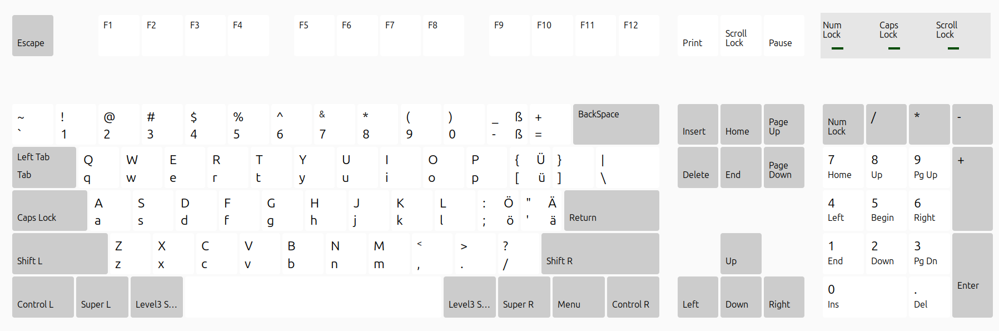

# keyboard-de-en

Mix keyboard layout for German software developers working with the US layout who occasionally need to type umlauts.



Keyboard switching between American (US) and German (DE) layouts slows everything down. The US layout is ideal for software development — all special characters are easily reachable.

The idea: keep the standard US layout. German umlauts are typed by holding `Alt` and pressing the corresponding German keys i.e.

| Keys                     | Result |
| ------------------------ | ------ |
| Alt + <kbd>;</kbd>       | ö      |
| Shift+Alt + <kbd>;</kbd> | Ö      |
| Alt + <kbd>'</kbd>       | ä      |
| Shift+Alt + <kbd>'</kbd> | Ä      |
| Alt + <kbd>[</kbd>       | ü      |
| Shift+Alt + <kbd>[</kbd> | Ü      |
| Alt + <kbd>-</kbd>       | ß      |

> On Windows, use `AltGr` (right Alt) or `Ctrl+Alt` instead of `Alt`.

## macOS

Open `macos/EN_DE_Mix_Keylayout.keylayout` with [Ukelele](https://software.sil.org/ukelele/) and press **Install**.

See also: detailed notes are in the macOS layout file itself.

## Windows

1. Install [Microsoft Keyboard Layout Creator](https://www.microsoft.com/en-us/download/details.aspx?id=102134).
2. Open `windows/EN-DE-Accents.klc` in the tool.
3. Click **Project → Build DLL and Setup Package**.
4. Run the generated setup package.
5. Reboot, then go to **Settings → Time & Language → Language & Region → Keyboards** and add **"US - German Accents"**.

See also: [README-windows.md](README-windows.md)

## Linux (Ubuntu 22.04 / 24.04)

```bash
make prepare       # check and install dependencies
make check         # show current installation status
sudo make install  # install layout system-wide
```

Then **log out and back in**, and add the layout under:
> Settings → Keyboard → Input Sources → `+` → search for **"German (US Mix)"**

Other commands:

| Command              | Description                                    |
|----------------------|------------------------------------------------|
| `make check`         | Show installation status                       |
| `sudo make update`   | Update symbol file only                        |
| `sudo make uninstall`| Remove layout completely                       |
| `make load`          | Temporarily load for this session (no reboot)  |

See also: [README-linux.md](README-linux.md)
